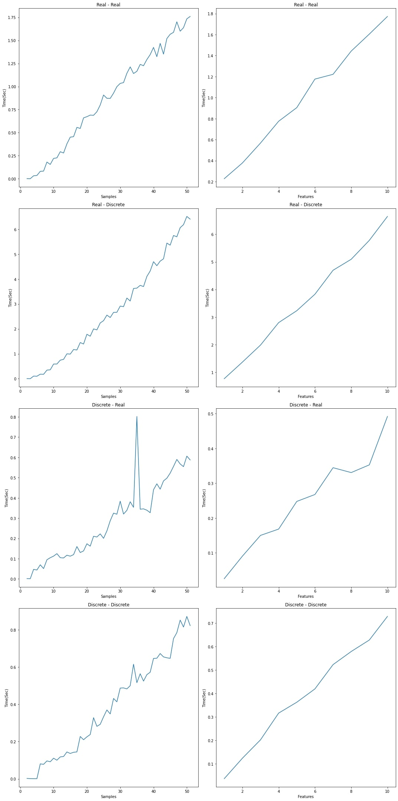

Let $N$ be the number of samples, $M$ be the number of features, and $d$ be the depth of the decision tree we have built.

When we build a decision tree, the depth of the tree is $O(\log N)$ if used real valued inputs. As each node will have two children. If we use discrete values as input, then  a node can have more than $2$ children. Along with that, if the split is done in $1$ and $N-1$ fashion, then the worst case depth with in $O(N)$. 

Therefore the time complexity for decision tree is in $O(NMd)$. 

We fix $d=5$ and experiment by varying $N$ and fixing $M$ to see the time taken as the number of samples increases. Also, we conducted an experiment where we fix $N=50$ and vary the number of features and observe how it effects the decision tree. We execute the following lines for the experiment:
```shell
python3 experiment.py
```
<p align="center">
  
</p>
